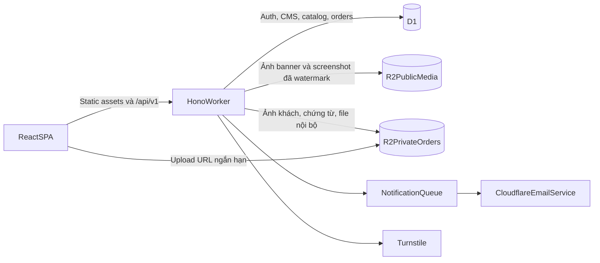

# Kế hoạch full-stack Cloudflare cho DearLove

## 1. Mục tiêu và ranh giới

### Mục tiêu đã chốt

- DearLove trước hết là website quảng bá sản phẩm thiệp, không phải nền tảng tự thiết kế thiệp.
- Catalog chỉ hiển thị ảnh chụp toàn trang của mẫu. Không tạo route preview chạy mã mẫu và không trỏ tới website mẫu gốc.
- Khách đăng ký tài khoản, chọn mẫu, tạo đơn, điền thông tin sự kiện và tải lên một nhóm/thư mục ảnh.
- Đội ngũ xử lý đơn thủ công nhưng mọi trạng thái, trao đổi, file và lịch sử thay đổi phải được quản lý rõ trong admin.
- Thanh toán ở bản đầu được xác nhận thủ công; chưa tích hợp cổng thanh toán.
- Admin chỉnh sửa sâu nội dung marketing: banner, ảnh, CTA, số liệu, FAQ, giá, blog, thông tin liên hệ, thứ tự/ẩn hiện section và catalog.
- FE, API và dữ liệu chạy trên Cloudflare; ưu tiên dịch vụ native của Cloudflare.

### Ngoài phạm vi MVP

- Trình kéo-thả hoặc editor để khách tự thiết kế thiệp.
- Route chạy hoặc công khai source của mẫu thiệp.
- Thanh toán online, subscription tự động, hóa đơn điện tử.
- Cộng tác realtime, WebSocket và Durable Objects.
- KV làm nguồn dữ liệu chính; Vectorize, Workers AI, Stream và Workflows.
- CMS cho phép nhập HTML/JavaScript tùy ý. Admin chỉ chỉnh các block có schema để tránh XSS và phá layout.
- Social login ở vòng đầu; email và mật khẩu là luồng chính.

## 2. Hiện trạng phải xử lý trước

- [src/App.tsx](../src/App.tsx) là React SPA với `/`, `/templates`, `/pricing`, `/contact`, `/blog`, `/auth`; các route `/preview/:id`, `/blog/:slug`, `/register`, `/forgot-password`, `/terms`, `/privacy` chưa tồn tại.
- [src/main.tsx](../src/main.tsx) còn instrumentation gửi dữ liệu tới localhost và monkey-patch `console.error`; phải loại bỏ trước production.
- [src/pages/auth/Auth.tsx](../src/pages/auth/Auth.tsx) và [src/pages/blog/BlogNewsletter.tsx](../src/pages/blog/BlogNewsletter.tsx) chỉ giả lập submit bằng delay.
- [src/pages/templates/templatesData.ts](../src/pages/templates/templatesData.ts), [src/pages/pricing/pricingData.ts](../src/pages/pricing/pricingData.ts), [src/pages/blog/blogData.ts](../src/pages/blog/blogData.ts), [src/pages/contact/contactData.ts](../src/pages/contact/contactData.ts) và [src/lib/constants.ts](../src/lib/constants.ts) là các nguồn dữ liệu hard-code, trùng taxonomy và lệch thương hiệu DearLove/ZenLove.
- [src/sections/TemplatesSection.tsx](../src/sections/TemplatesSection.tsx) và trang `/templates` dùng hai catalog khác nhau; cần hợp nhất.
- [wrangler.jsonc](../wrangler.jsonc) hiện chỉ phục vụ `dist` dạng SPA, chưa có Worker entrypoint, D1, R2, Queue, Email hoặc Turnstile secret.
- [package.json](../package.json) thiếu Wrangler, Cloudflare Vite plugin, API framework, ORM, auth, lint thực sự và quy trình deploy.

## 3. Kiến trúc được chọn



### Quyết định kỹ thuật

- Giữ React 18, Vite và React Router để tránh migration không tạo giá trị cho MVP.
- Thêm Cloudflare Vite plugin và một `worker/index.ts`; dùng Hono để chia route/middleware theo domain nhưng deploy thành một Worker.
- Dùng cùng origin cho FE và `/api/v1`, giảm CORS và cho phép session cookie `HttpOnly`, `Secure`, `SameSite=Lax/Strict`.
- Dùng Better Auth + Drizzle SQLite adapter trên D1; bật `nodejs_compat` vì Better Auth dùng `AsyncLocalStorage`. Chỉ bật email/password trước, dành chỗ cho OAuth sau.
- Dùng D1 cho dữ liệu quan hệ và metadata; migration được version hóa trong `migrations/`, index theo truy vấn thực tế.
- Tách hai bucket R2:
  - `PUBLIC_MEDIA`: banner, blog cover, logo, ảnh catalog đã resize/watermark; phục vụ qua domain media hoặc endpoint cacheable.
  - `PRIVATE_UPLOADS`: ảnh đơn hàng, chứng từ và file nội bộ; không public bucket, chỉ truy cập sau authorization hoặc URL ký ngắn hạn.
- Upload ảnh đơn hàng trực tiếp tới R2 qua presigned `PUT`, tránh buffer file trong Worker và tránh giới hạn bộ nhớ Worker 128 MB. API chỉ cấp quyền cho object key thuộc user/order và xác nhận metadata sau upload.
- Cloudflare Turnstile bảo vệ đăng ký, quên mật khẩu, newsletter, contact và các endpoint public ghi dữ liệu; token luôn được xác minh server-side.
- Queue chỉ nhận payload nhỏ chứa ID, không chứa ảnh/PII đầy đủ; consumer gửi email xác nhận và thông báo admin bằng Cloudflare Email Service. Nếu Email Service chưa được cấp cho tài khoản, notification center trong admin vẫn là nguồn sự thật.
- Không dùng Durable Objects hoặc KV trong MVP vì không có realtime và dữ liệu cần quan hệ/nhất quán.
- Với SEO/social metadata, Worker chạy trước trên các route marketing cần metadata động, đọc metadata đã publish rồi dùng `HTMLRewriter` trên SPA shell; `/api/*` luôn chạy Worker trước. Asset fingerprint vẫn được phục vụ trực tiếp.

## 4. Cấu trúc mã đích

```text
src/
  app/                 router, providers, auth state, API client
  components/          primitives và shared UI
  features/
    auth/
    catalog/
    orders/
    account/
    admin/
    content/
    blog/
    contact/
  pages/               route composition
  lib/                  validation/client utilities
worker/
  index.ts              Hono composition và asset fallback
  middleware/           session, role, CSRF/origin, rate/error handling
  modules/
    auth/
    catalog/
    content/
    orders/
    uploads/
    contacts/
    newsletter/
    admin/
    notifications/
  db/
    client.ts
    schema.ts
    queries/
  lib/                  response contract, validation, audit, crypto
migrations/             D1 SQL migrations
public/                 chỉ asset build-time thật sự tĩnh
```

## 5. Mô hình dữ liệu D1

### Xác thực và phân quyền

- Bảng Better Auth: `user`, `session`, `account`, `verification` theo schema generator tại phiên bản được cài.
- Mở rộng user bằng `role = customer | admin`, `status = active | suspended`, `phone`, `email_verified_at` nếu adapter không quản lý trường tương đương.
- Chỉ admin hiện hữu mới được tạo/mời admin khác; không có public admin registration.

### CMS và media

- `site_settings`: brand name, domain, logo, hotline, email, social links, default SEO, theme tokens được cho phép.
- `pages`: `key`, slug, title, SEO title/description/image, status, published revision, timestamps.
- `page_sections`: page, stable key, block type, position, visibility, typed JSON payload, draft/published state.
- `content_revisions`: snapshot trước/sau, author, publish note, thời điểm; hỗ trợ rollback nội dung.
- `media_assets`: bucket, object key, owner scope, purpose, MIME, size, width/height, checksum, alt text, visibility, trạng thái upload.
- Payload block được validate bằng schema theo `block_type`; không render raw HTML từ admin.

### Catalog

- `template_categories`: taxonomy duy nhất, slug, tên, mô tả, position, status.
- `templates`: slug nội bộ, code hiển thị, tên, category, mô tả, tier/giá tham khảo, badges, status `draft|published|archived`, featured, sort order, SEO fields.
- `template_screenshots`: template, media asset, variant `thumbnail|fullpage`, dimensions, position, watermark version.
- Không lưu hoặc trả URL của source template. API public chỉ trả derivative screenshot và metadata marketing.

### Đơn hàng thủ công

- `orders`: mã đơn dễ đọc, customer, template, package snapshot, trạng thái, payment status thủ công, event date, deadline mong muốn, contact snapshot, tổng tiền báo giá, timestamps.
- `order_form_answers`: field key, label snapshot, value JSON; cho phép form khác nhau theo loại thiệp mà không đổi schema liên tục.
- `order_upload_groups`: nhóm `couple_photos|family_photos|venue|payment_proof|other`, giới hạn và trạng thái hoàn tất.
- `order_files`: order, group, media asset, original filename, position, customer note.
- `order_status_history`: from/to status, actor, reason, timestamp.
- `order_notes`: note public với khách hoặc internal-only, author, timestamp.
- `order_assignments`: admin phụ trách và lịch sử phân công nếu có nhiều nhân sự.
- `notifications`: recipient, type, channel, payload tối thiểu, read/sent/failed state.
- Trạng thái đơn: `draft -> submitted -> reviewing -> awaiting_customer -> confirmed -> in_production -> ready -> delivered -> completed`; `cancelled` là nhánh kết thúc có lý do.
- Trạng thái thanh toán: `unpaid -> pending_verification -> paid`; có `refunded` để dự phòng nhưng không tự động hóa thanh toán.

### Marketing operations

- `pricing_plans`: nội dung gói và giá hiển thị; đây là catalog giá, chưa phải subscription engine.
- `blog_posts`, `blog_categories`, `authors`: draft/published, slug, nội dung block/Markdown đã sanitize, SEO và lịch publish.
- `contact_submissions`: họ tên, kênh liên hệ, chủ đề, nội dung, trạng thái, người phụ trách.
- `newsletter_subscribers`: email unique, trạng thái pending/active/unsubscribed, consent timestamp.
- `audit_logs`: admin, action, entity, entity ID, metadata không chứa secret, timestamp.

### Quy ước dữ liệu

- ID dùng UUID/ULID dạng text; mã đơn là identifier riêng, không dùng ID tuần tự công khai.
- Timestamp lưu UTC; FE định dạng theo múi giờ Việt Nam.
- Foreign key rõ ràng; unique index cho email/slug/order code; index ghép cho danh sách đơn theo `(status, created_at)`, `(customer_id, created_at)`, nội dung theo `(status, published_at)` và file theo `(order_id, group_id)`.
- File nhị phân không lưu trong D1; D1 chỉ giữ metadata R2.
- Nội dung publish dùng snapshot/revision để bản public ổn định khi admin đang sửa draft.

## 6. Hợp đồng API

### Quy ước chung

- Base path `/api/v1`; auth handler ở `/api/auth/*`.
- JSON response nhất quán: `data`, `error.code`, `error.message`, `requestId`; không trả stack trace.
- Validate body/query/params phía server; giới hạn kích thước JSON trước khi parse.
- Cursor pagination cho admin list, catalog và blog; filter/sort được whitelist.
- Mọi mutation admin ghi audit log.
- Cùng-origin cookie session; kiểm tra `Origin` cho mutation và không lưu token trong `localStorage`.

### API public

- `GET /site/bootstrap`: settings, menu và các content section đã publish.
- `GET /templates`: category, tier, featured, sort và pagination.
- `GET /templates/:slug`: metadata và danh sách screenshot public; không có URL/source preview.
- `GET /pricing`, `GET /blog`, `GET /blog/:slug`, `GET /contact-info`.
- `POST /contact-submissions` và `POST /newsletter-subscriptions`, có Turnstile, idempotency và chống spam.

### API khách hàng

- `GET/PATCH /me`, `GET /me/orders`, `GET /me/orders/:id`.
- `POST /orders` tạo draft từ template; `PATCH /orders/:id` lưu form; `POST /orders/:id/submit` khóa snapshot và tạo lịch sử.
- `POST /orders/:id/uploads/prepare` tạo object key server-side và presigned URL ngắn hạn.
- `POST /orders/:id/uploads/complete` kiểm tra object tồn tại, MIME/size/checksum rồi tạo metadata.
- `DELETE /orders/:id/files/:fileId` chỉ khi đơn còn cho phép sửa.
- `POST /orders/:id/messages` để khách bổ sung thông tin; không biến email thành nguồn dữ liệu duy nhất.
- `POST /orders/:id/payment-proof` tùy chọn nếu quy trình thủ công dùng chuyển khoản.

### API admin

- Dashboard: số đơn theo trạng thái, đơn quá hạn, contact chưa xử lý, upload lỗi.
- CRUD + draft/preview/publish/rollback cho settings, pages, sections, pricing, blog, categories và templates.
- Upload/quản lý media public; tạo thumbnail/full-page derivative và watermark version.
- Danh sách đơn với filter, search, pagination; xem form/file; assign; đổi trạng thái; cập nhật payment; thêm note; tải file có URL ngắn hạn.
- Quản lý user: xem hồ sơ/đơn, suspend/restore; không đọc password hoặc session secret.
- Quản lý contact/newsletter và audit log.

## 7. Luồng chức năng

### Catalog bảo mật

1. Admin tạo template draft và upload ảnh chụp gốc vào vùng private xử lý.
2. Hệ thống tạo derivative web, watermark và thumbnail; chỉ derivative được đưa vào `PUBLIC_MEDIA`.
3. Admin xem preview của card/detail rồi publish revision.
4. Khách xem screenshot, filter và chọn mẫu; card có `Chọn mẫu`, không có `Mở website mẫu`.
5. Ảnh public vẫn có thể bị tải/chụp lại; watermark và việc không công khai mã/URL chỉ bảo vệ source, không thể ngăn sao chép tuyệt đối.

### Đăng ký và tài khoản

1. Khách đăng ký email/password + Turnstile, chấp thuận điều khoản.
2. Tạo user ở trạng thái phù hợp và gửi email xác minh qua Queue/Email Service.
3. Sau xác minh, khách đăng nhập và nhận session cookie.
4. Quên mật khẩu dùng token một lần, có hạn; logout hủy session.
5. Route customer/admin có guard ở cả FE và API; API là nguồn phân quyền cuối cùng.

### Đặt thiệp

1. Khách chọn template đã publish; nếu chưa đăng nhập, chuyển đến auth với `returnTo` an toàn.
2. Tạo order draft chứa snapshot template/gói tại thời điểm đặt.
3. Wizard lưu từng bước: thông tin liên hệ, thông tin sự kiện, nội dung thiệp, yêu cầu thiết kế, ảnh và xác nhận.
4. Upload nhiều file theo nhóm; hỗ trợ chọn nhiều file và chọn folder trên trình duyệt có hỗ trợ, nhưng không phụ thuộc duy nhất vào `webkitdirectory`.
5. FE hiển thị progress, retry, duplicate, định dạng/kích thước lỗi và file đã hoàn tất.
6. Submit dùng idempotency key để tránh tạo/gửi đơn hai lần.
7. Khách nhận mã đơn và theo dõi trạng thái trong tài khoản.

### Xử lý thủ công trong admin

1. Đơn mới vào hàng `submitted`, tạo notification và email.
2. Admin kiểm tra form/file, assign người xử lý, đổi sang `reviewing`.
3. Thiếu dữ liệu thì chuyển `awaiting_customer` kèm note public; khách bổ sung rồi admin tiếp tục.
4. Admin xác nhận báo giá/thanh toán thủ công, đưa đơn qua production, ready, delivered, completed.
5. Mọi thay đổi trạng thái/payment/assignment được ghi history và audit.
6. File tải xuống chỉ qua authorization và URL ngắn hạn; không để key R2 private trong content public.

### CMS

1. Admin sửa draft theo block typed; ảnh chọn từ media library.
2. Preview draft dùng route admin có quyền, không làm thay đổi public.
3. Publish atomically cập nhật revision đang hoạt động và cache headers/version.
4. Public app tải bootstrap đã publish; lỗi API có fallback UI rõ, không âm thầm dùng copy cũ không xác định.
5. Rollback tạo revision mới từ snapshot cũ để giữ audit trail.

## 8. Các đơn vị triển khai theo thứ tự

### U1 — Làm sạch prototype và chuẩn hóa thương hiệu

**Files:** [src/main.tsx](../src/main.tsx), [src/App.tsx](../src/App.tsx), [src/lib/constants.ts](../src/lib/constants.ts), [src/sections/Header.tsx](../src/sections/Header.tsx), [src/sections/Footer.tsx](../src/sections/Footer.tsx), các file data/page hiện hữu.

- Xóa instrumentation localhost và mã debug tạm.
- Chốt DearLove là thương hiệu canonical; gom contact/domain/social/phone vào một nguồn.
- Sửa CTA/anchor chết, thay `/register` bằng `/auth?mode=register`, bỏ route preview và chuyển template click thành chọn mẫu.
- Thêm route thật cho terms/privacy/404; chưa kết nối backend giả.
- Hợp nhất taxonomy/catalog home và `/templates`; dọn duplicate CSS/component trong đúng phạm vi.
- Kiểm tra tất cả route và CTA không dẫn đến placeholder ngoài chủ ý.

### U2 — Nền tảng Cloudflare full-stack

**Files:** [package.json](../package.json), [vite.config.ts](../vite.config.ts), [wrangler.jsonc](../wrangler.jsonc), [tsconfig.json](../tsconfig.json), [.gitignore](../.gitignore), `worker/index.ts`, generated `worker-configuration.d.ts`.

- Cài Cloudflare Vite plugin, Wrangler v4+, Hono và dependencies có version khóa.
- Thêm Worker entrypoint, `nodejs_compat`, ASSETS, `run_worker_first` cho `/api/*` và các route metadata động.
- Tách bindings dev/staging/production; D1/R2/Queue không dùng chung giữa staging và production.
- Bổ sung scripts dev/build/preview/deploy/typegen/migration; chạy `wrangler types` sau mọi thay đổi binding.
- Thiết lập error response, request ID, structured logging, security headers, CSP và cache policy.
- Kiểm tra SPA deep link, API navigation, asset fallback và metadata route không xung đột.

### U3 — D1 schema, ORM và migration nền

**Files:** `worker/db/schema.ts`, `worker/db/client.ts`, `drizzle.config.ts`, `migrations/*.sql`, [wrangler.jsonc](../wrangler.jsonc).

- Tạo schema auth, CMS, catalog, order, upload, contact, newsletter, notification và audit.
- Tạo constraints/index theo truy vấn; migration chạy local trước staging rồi production.
- Seed duy nhất cho admin đầu tiên, role và nội dung nền; không có secret trong seed.
- Định nghĩa backup/export và rollback migration có dữ liệu.
- Xác minh foreign key, unique email/slug/order code, status transition và query plan cho màn admin.

### U4 — Auth và authorization

**Files:** `worker/modules/auth/*`, `worker/middleware/session.ts`, `worker/middleware/authorize.ts`, `src/features/auth/*`, [src/pages/auth/Auth.tsx](../src/pages/auth/Auth.tsx), `src/app/AuthProvider.tsx`.

- Better Auth email/password, verify email, login/logout, reset password, session cookie.
- Role customer/admin, route guard và API guard; admin bootstrap không public.
- Turnstile server-side, origin/CSRF policy, rate limit và generic auth errors chống account enumeration.
- Hỗ trợ `returnTo` chỉ cho same-origin allowlisted path.
- Bao phủ đăng ký trùng email, token hết hạn/dùng lại, sai mật khẩu, suspended user, session hết hạn và truy cập sai role.

### U5 — CMS core và media public

**Files:** `worker/modules/content/*`, `worker/modules/admin/content/*`, `src/features/admin/content/*`, `src/features/admin/media/*`, `src/app/content/*`.

- Site settings, page/section typed blocks, media library, draft/preview/publish/revision/rollback.
- Upload ảnh public, validate MIME/size/dimensions, alt text bắt buộc cho ảnh nội dung.
- Layout variants và theme token nằm trong allowlist; sanitize blog rich text/Markdown.
- Public bootstrap có cache validator/version; admin publish invalidates dữ liệu theo chiến lược đã chọn.
- Bao phủ concurrent edits bằng revision/version check để tránh ghi đè im lặng.

### U6 — Catalog screenshot bảo mật

**Files:** `worker/modules/catalog/*`, `worker/modules/admin/catalog/*`, `src/features/catalog/*`, [src/pages/templates/Templates.tsx](../src/pages/templates/Templates.tsx), [src/pages/templates/TemplateCard.tsx](../src/pages/templates/TemplateCard.tsx), [src/sections/TemplatesSection.tsx](../src/sections/TemplatesSection.tsx).

- CRUD category/template; upload screenshot; tạo derivative thumbnail/fullpage và watermark.
- Public catalog filter/sort/search/pagination dùng một taxonomy.
- Detail modal/page chỉ hiển thị screenshot và CTA chọn mẫu, không trả source URL.
- Draft/archived không xuất hiện public; template đã dùng trong order không bị hard-delete.
- Bao phủ ảnh lỗi, empty state, slug trùng, publish thiếu screenshot, filter URL và responsive full-page image.

### U7 — Customer account và hồ sơ

**Files:** `src/features/account/*`, `worker/modules/users/*`, [src/App.tsx](../src/App.tsx).

- Dashboard khách, hồ sơ, danh sách đơn, trạng thái và notification.
- Navigation thay đổi theo session; loading/session-expired/error rõ ràng.
- Khách chỉ thấy tài nguyên của mình; mọi object-level authorization được kiểm tra server-side.

### U8 — Wizard đặt thiệp và order API

**Files:** `worker/modules/orders/*`, `src/features/orders/*`, `src/pages/orders/*`, `src/lib/api/*`.

- Tạo draft từ template, autosave form theo bước, package/template snapshot và submit idempotent.
- Form schema theo loại thiệp; validation client để UX, server để an toàn.
- Chặn sửa field nhạy cảm sau submit; cho bổ sung theo yêu cầu admin.
- Màn thành công trả order code và timeline; refresh/relogin không mất draft đã lưu.
- Bao phủ double submit, template vừa archived, event date sai, autosave conflict, mạng rớt và resume draft.

### U9 — Upload ảnh đơn hàng vào R2 private

**Files:** `worker/modules/uploads/*`, `src/features/orders/uploads/*`, [wrangler.jsonc](../wrangler.jsonc).

- Prepare/complete/delete upload; object key do server tạo theo user/order UUID, không tin filename làm key.
- Presigned URL ngắn hạn, content type/size allowlist, checksum và orphan cleanup.
- Multi-file progress, retry/cancel, duplicate detection, reorder và group completeness.
- Admin download/preview qua quyền tạm thời; cache `private, no-store` cho endpoint nhạy cảm.
- Bao phủ URL hết hạn, upload chưa complete, MIME giả, file vượt giới hạn, xóa giữa upload và user truy cập order khác.

### U10 — Admin quản lý đơn hàng

**Files:** `worker/modules/admin/orders/*`, `src/features/admin/orders/*`, `src/features/admin/dashboard/*`.

- Dashboard, searchable queue, filter, sort, pagination, order detail, gallery/file groups.
- State machine server-side, assignment, public/internal note, manual payment status, timeline.
- Optimistic concurrency để hai admin không ghi đè; audit cho mọi mutation.
- Export CSV metadata đơn; file binary tải riêng, không nhúng hàng loạt vào export.
- Bao phủ transition không hợp lệ, admin đồng thời, order cancelled, payment rollback có lý do và file thiếu.

### U11 — Contact, newsletter và notification automation

**Files:** `worker/modules/contacts/*`, `worker/modules/newsletter/*`, `worker/modules/notifications/*`, `worker/queue.ts`, [src/pages/contact/Contact.tsx](../src/pages/contact/Contact.tsx), [src/pages/blog/BlogNewsletter.tsx](../src/pages/blog/BlogNewsletter.tsx), [src/sections/Footer.tsx](../src/sections/Footer.tsx).

- Form contact thật, trạng thái xử lý trong admin, newsletter consent/unsubscribe.
- Turnstile, rate limit, honeypot và idempotency cho public forms.
- Queue cho verify/reset/order submitted/status changed/contact created; retry và dead-letter handling.
- Cloudflare Email Service dùng template versioned, sender domain verified; lỗi email không rollback đơn đã lưu.
- Bao phủ duplicate subscriber, unsubscribe, Turnstile timeout/duplicate, Queue retry và email failure.

### U12 — Blog, pricing và phần marketing còn lại

**Files:** `worker/modules/blog/*`, `worker/modules/pricing/*`, `src/features/blog/*`, [src/pages/blog/Blog.tsx](../src/pages/blog/Blog.tsx), [src/pages/pricing/Pricing.tsx](../src/pages/pricing/Pricing.tsx), các section home.

- Chuyển blog, pricing, FAQ, banner, testimonials, stats, office và social links sang CMS.
- Thêm blog detail, category filter thống nhất, draft/schedule/publish và per-route SEO.
- Giá chỉ là nội dung marketing trong MVP; CTA tạo order hoặc liên hệ, không ngụ ý checkout tự động.
- Xóa countdown giả và mọi số liệu chưa được xác minh hoặc đánh dấu nội bộ là nội dung cần duyệt.
- Bao phủ bài chưa publish, slug cũ/redirect, schedule timezone, content rỗng và ảnh social fallback.

### U13 — SEO, accessibility, hiệu năng và trải nghiệm lỗi

**Files:** [index.html](../index.html), [src/App.tsx](../src/App.tsx), `worker/modules/seo/*`, shared UI/CSS.

- Metadata route, canonical, Open Graph, sitemap, robots, JSON-LD phù hợp.
- Route-level lazy loading, image dimensions/srcset/lazy loading, font strategy và reduced motion.
- Error boundary, not-found thật trong UI, skeleton, retry và toast/focus management.
- Rà keyboard/focus/label/contrast/tap target; carousel không bắt phím toàn document.
- Theo dõi Core Web Vitals và bundle budget; tránh D1 call cho fingerprinted static assets.

### U14 — Vận hành, bảo mật và phát hành

**Files:** [wrangler.jsonc](../wrangler.jsonc), [package.json](../package.json), `.gitlab-ci.yml` khi repository GitLab được tạo, tài liệu vận hành hiện hữu.

- Pipeline typecheck/lint/build/typegen/migration check/deploy staging/production có phê duyệt.
- Secrets qua Worker secrets/Secrets Store; không commit `.dev.vars` hoặc credential R2.
- Workers Logs/traces, sampling, alert theo error rate; xóa hoàn toàn telemetry localhost.
- Backup D1 định kỳ, kiểm tra restore; R2 lifecycle cho orphan/temp và retention file theo chính sách.
- Runbook rollback Worker, rollback content revision, xử lý migration lỗi, Queue backlog và email outage.
- Security review trước production: auth, object authorization, upload, XSS, CSP, PII logging, retention và quyền admin.

## 9. Phân kỳ phát hành

### Milestone 0 — Baseline an toàn

- U1–U3: dọn prototype, Cloudflare full-stack skeleton, schema/migration và staging.
- Exit gate: deploy staging tái lập được; static route/API/D1/R2 bindings đúng; không còn request localhost hoặc link chuyển đổi chết.

### Milestone 1 — Nội dung và catalog do admin quản lý

- U4–U6: auth/role, CMS, media, catalog screenshot.
- Exit gate: admin có thể tạo, preview, publish và rollback toàn bộ nội dung/catalog mà không sửa code; public không nhận source URL mẫu.

### Milestone 2 — Luồng tạo đơn hoàn chỉnh

- U7–U10: customer account, wizard, R2 private upload, admin order operations.
- Exit gate: khách đăng ký → chọn mẫu → gửi form và ảnh → nhận mã đơn; admin xử lý đến completed với history/audit đầy đủ.

### Milestone 3 — Tự động hóa và hoàn thiện marketing

- U11–U13: contact/newsletter/email queue, blog/pricing CMS, SEO/a11y/performance.
- Exit gate: public forms chống spam, notification retry được, nội dung marketing không còn hard-code quan trọng, metadata đúng theo route.

### Milestone 4 — Production readiness

- U14 và nghiệm thu dữ liệu/content thật.
- Exit gate: production deploy có rollback/backup/monitoring, sender domain và custom domain đã xác minh, quyền truy cập private upload được rà soát.

## 10. Điều kiện nghiệm thu toàn hệ thống

- Người chưa đăng nhập chỉ xem nội dung đã publish và screenshot derivative; không thể lấy file order/private hoặc source template.
- Customer A không thể đọc/sửa order hay file của Customer B dù tự thay URL/ID.
- Admin chỉnh banner, CTA, ảnh, giá, FAQ, blog, contact, category và template rồi preview/publish/rollback được.
- Đơn giữ được draft qua reload; submit lặp không tạo đơn trùng; mọi transition có actor, thời gian và lý do.
- Upload lớn không được buffer toàn bộ trong Worker; file sai loại/quá kích thước/orphan được chặn hoặc dọn.
- Lỗi email/Queue không làm mất đơn; admin thấy notification failure để retry.
- Không có secret trong client bundle, source, log hoặc D1 content; session chỉ ở secure cookie.
- Staging và production dùng bindings/secrets/data riêng; migration và deploy có thứ tự, backup và rollback rõ.
- Public route có metadata/canonical hợp lệ, responsive, keyboard usable, reduced-motion và trạng thái loading/error/empty.

## 11. Rủi ro và biện pháp

- **Hiểu sai “bảo mật screenshot”:** ảnh public không thể chống tải tuyệt đối. Chỉ public derivative có watermark; source template và ảnh capture gốc luôn private.
- **CMS quá tự do:** raw HTML gây XSS và phá UI. Dùng typed block, allowlist layout/theme và validation hai phía.
- **D1 nghẽn do query admin:** index theo filter chính, cursor pagination, `EXPLAIN QUERY PLAN`; không đếm toàn bảng trong request nóng.
- **Upload ảnh làm quá tải Worker:** direct-to-R2 presigned upload, giới hạn MIME/size/count, checksum và cleanup job.
- **Auth dependency drift:** khóa version Better Auth/Drizzle/Hono, sinh migration từ version thực tế và kiểm tra runtime Workers trước production.
- **Email Service chưa sẵn sàng:** admin notification trong D1 là nguồn sự thật; email là kênh bổ sung và có retry/failure state.
- **Content/data cũ mâu thuẫn:** trước seed production phải duyệt brand, domain, hotline, giá, SLA, văn phòng, testimonial và số liệu marketing.
- **SPA SEO hạn chế:** Worker inject metadata và sitemap trong MVP; chỉ đánh giá chuyển SSR khi organic SEO thực sự bị hạn chế sau đo lường.

## 12. Nguồn kỹ thuật đã đối chiếu

- Cloudflare Workers Static Assets và SPA routing, cập nhật tháng 7–8/2026: một deployment có thể chứa Worker + static assets; dùng `run_worker_first` cho `/api/*` và route chọn lọc.
- Cloudflare Vite React SPA + API tutorial, cập nhật 05/09/2026: plugin hỗ trợ dev/build/preview thống nhất với Workers runtime.
- Workers limits, cập nhật 05/09/2026: 128 MB memory; Free 100.000 request/ngày và 10 ms CPU; static asset tối đa 25 MiB/file.
- D1 limits, cập nhật 21/04/2026: 10 GB/database paid, 500 MB free; mỗi database xử lý query tuần tự nên index và query ngắn là bắt buộc.
- R2 limits/API, cập nhật 06–08/2026: direct upload và presigned URL phù hợp file khách; public production nên dùng custom domain, không dùng `r2.dev`.
- Turnstile validation, cập nhật 05/05/2026: token 5 phút, dùng một lần và bắt buộc xác minh server-side.
- Workers best practices, cập nhật 20/08/2026: bindings thay REST, generated binding types, secrets ngoài source, streaming và Queue cho tác vụ retryable.
- Cloudflare Email Service Workers API, cập nhật 25/06/2026: native send binding, sender domain cần xác minh và phải xử lý quota/failure.
